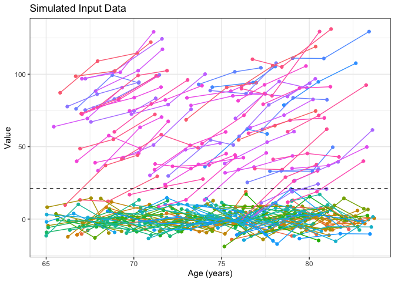
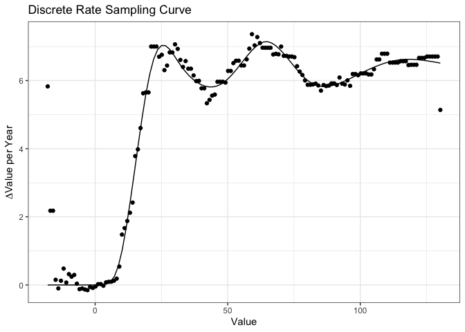
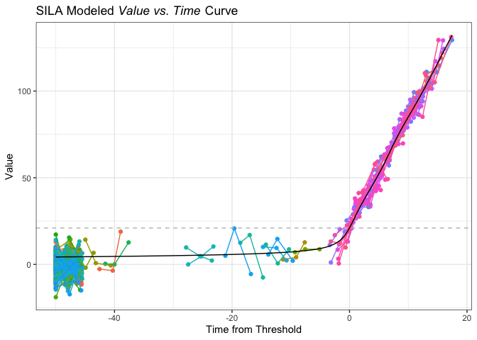
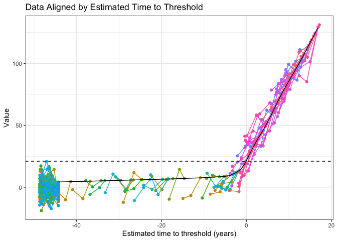
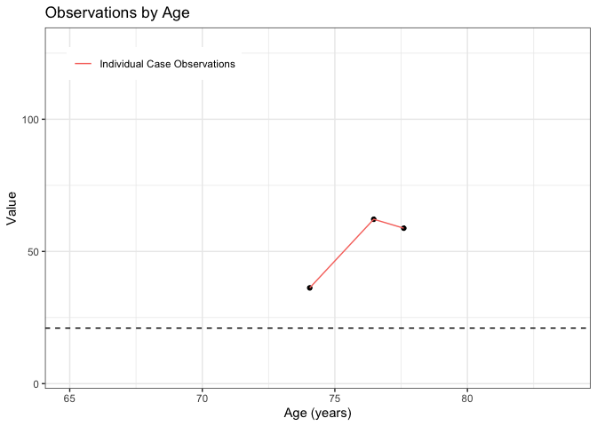
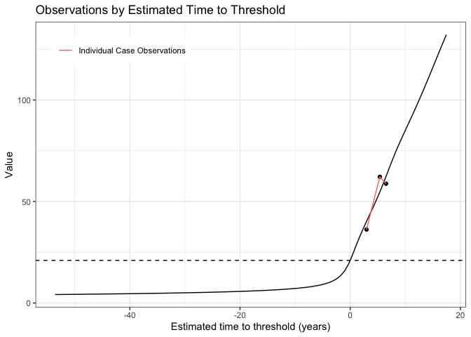

<!-- README.md is generated from README.Rmd. Please edit that file -->

# silaR

<!-- badges: start -->

[](https://github.com/bilgelm/silaR/actions/workflows/check-R-and-matlab.yaml)
[](https://results.pre-commit.ci/latest/github/bilgelm/silaR/main)
<!-- badges: end -->

silaR is an R implementation of Sampled Iterative Local Approximation
(SILA).

The original [Matlab implementation of
SILA](https://github.com/Betthauser-Neuro-Lab/SILA-AD-Biomarker) was
developed by Dr. Tobey Betthauser at the University of Wisconsin-Madison
to model longitudinal amyloid PET data and estimate individual A+ onset
age. This algorithm may have applications in other areas where long-term
population trajectories can be surmised from shorter longitudinal
assessments of individuals.

## Installation

You can install the development version of silaR from
[GitHub](https://github.com/) with:

``` r
# install.packages("devtools")
devtools::install_github("bilgelm/silaR")
```

## Example

We illustrate how to run SILA in a simulated dataset, and then how to
localize each subject on the estimated trajectory.

``` r
library(silaR)

# Train the SILA model
df <- simulated_longitudinal_data
res <- sila(df, dt = 0.25, val0 = 21, maxi = 200)

resfit <- sila_estimate(res$tsila, df)
```

``` r
library(dplyr)
library(ggplot2)

# spaghetti plot of value vs. age for simulated data
ggplot(df, aes(x = age, y = val, group = subid, color = factor(subid))) +
  geom_point() +
  geom_line() +
  geom_hline(yintercept = 21, color = "black", linetype = "dashed") +
  xlab("Age (years)") +
  ylab("Value") +
  ggtitle("Simulated Input Data") +
  theme_bw() +
  theme(legend.position = "none")
```



``` r
# plots showing the output from discrete rate sampling (i.e., rate vs. value)
# and modeled value vs. time data.
ggplot(res$tdrs, aes(x = val, y = rate)) +
  geom_ribbon(aes(ymin = rate - ci, ymax = rate + ci), alpha = .3) +
  geom_line() +
  xlab("Value") +
  ylab(expression(Delta * "Value per Year")) +
  ggtitle("Discrete Rate Sampling Curve") +
  theme_bw()

ggplot(res$tsila, aes(x = adtime, y = val)) +
  geom_line(aes(color = "Modeled curve")) +
  geom_hline(aes(yintercept = 21, color = "threshold"), linetype = "dashed") +
  xlab("Time from Threshold") +
  ylab("Value") +
  ggtitle(
    expression(paste("SILA Modeled ", italic("Value vs. Time"), " Curve"))
  ) +
  theme_bw() +
  theme(
    legend.title = element_blank(),
    legend.position = "inside",
    legend.position.inside = c(.15, .85)
  )
```



``` r
# value vs. time for all subjects
ggplot(
  resfit,
  aes(x = estdtt0, y = val, group = subid, color = factor(subid))
) +
  geom_point() +
  geom_line() +
  geom_line(
    data = res$tsila,
    aes(x = adtime, y = val, group = NULL, color = NULL)
  ) +
  geom_hline(yintercept = 21, color = "black", linetype = "dashed") +
  xlab("Estimated time to threshold (years)") +
  ylab("Value") +
  ggtitle("Data Aligned by Estimated Time to Threshold") +
  theme_bw() +
  theme(legend.position = "none")
```



``` r
# value vs. time for an individual case
one_res <- resfit %>%
  filter(estdtt0 > 1 & estdtt0 < 10) %>%
  group_by(subid) %>%
  mutate(nvis = n()) %>%
  ungroup() %>%
  filter(nvis == 3) %>%
  slice_head(n = 3)

ggplot(one_res, aes(x = age, y = val, group = subid)) +
  geom_point() +
  geom_line(aes(color = "Individual Case Observations")) +
  geom_hline(yintercept = 21, color = "black", linetype = "dashed") +
  xlim(range(df$age)) +
  ylim(range(res$tsila$val)) +
  xlab("Age (years)") +
  ylab("Value") +
  ggtitle("Observations by Age") +
  theme_bw() +
  theme(
    legend.title = element_blank(),
    legend.position = "inside",
    legend.position.inside = c(.2, .9)
  )

ggplot(one_res, aes(x = estdtt0, y = val, group = subid)) +
  geom_point() +
  geom_line(aes(color = "Individual Case Observations")) +
  geom_hline(yintercept = 21, color = "black", linetype = "dashed") +
  geom_line(
    data = res$tsila,
    aes(x = adtime, y = val, group = NULL, color = "SILA Modeled Values")
  ) +
  xlim(range(res$tsila$adtime)) +
  xlab("Estimated time to threshold (years)") +
  ylab("Value") +
  ggtitle("Observations by Estimated Time to Threshold") +
  theme_bw() +
  theme(
    legend.title = element_blank(),
    legend.position = "inside",
    legend.position.inside = c(.2, .9)
  )
```



## Development

### Style

#### Git

This repo follows the [Conventional
Commits](https://www.conventionalcommits.org/en/v1.0.0/#summary)
specification for commit messages. Pre-commit will automatically check
your commit message and fail your commit if your commit message doesn’t
conform to the specification.

## Citation

To cite package ‘silaR’ in publications use:

Betthauser TJ, Bilgel M, Koscik RL, Jedynak BM, An Y, Kellett KA,
Moghekar A, Jonaitis EM, Stone CK, Engelman CD, Asthana S, Christian BT,
Wong DF, Albert M, Resnick SM, Johnson SC (2022). “Multi-method
investigation of factors influencing amyloid onset and impairment in
three cohorts.” *Brain*, *145*(11), 4065-4079.
<doi:10.1093/brain/awac213> <https://doi.org/10.1093/brain/awac213>.

A BibTeX entry for LaTeX users is

@Article{, author = {Tobey J Betthauser and Murat Bilgel and Rebecca L
Koscik and Bruno M Jedynak and Yang An and Kristina A Kellett and Abhay
Moghekar and Erin M Jonaitis and Charles K Stone and Corinne D Engelman
and Sanjay Asthana and Bradley T Christian and Dean F Wong and Marilyn
Albert and Susan M Resnick and Sterling C Johnson}, title =
{Multi-method investigation of factors influencing amyloid onset and
impairment in three cohorts}, journal = {Brain}, year = {2022}, volume =
{145}, number = {11}, pages = {4065–4079}, doi =
{10.1093/brain/awac213}, }
