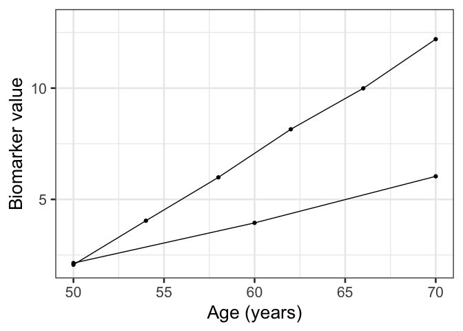
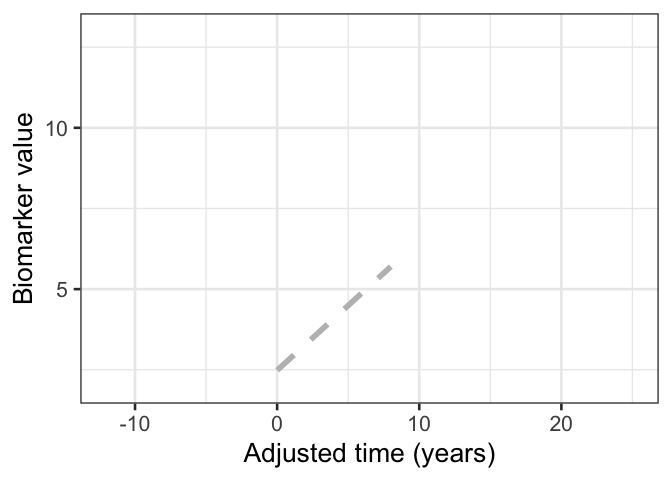

<!-- README.md is generated from README.Rmd. Please edit that file -->

# silaR

<!-- badges: start -->

[](https://github.com/bilgelm/silaR/actions/workflows/R-CMD-check.yaml)
[](https://results.pre-commit.ci/latest/github/bilgelm/silaR/main)
<!-- badges: end -->

silaR is an R implementation of Sampled Iterative Local Approximation
(SILA).

## Installation

You can install the development version of silaR from
[GitHub](https://github.com/) with:

``` r
# install.packages("devtools")
devtools::install_github("bilgelm/silaR")
```

## Example

As a simple example, we illustrate how to run ILLA without smoothing in
a dataset consisting of two individuals.

``` r
library(silaR)

set.seed(42)

# generate a simple small dataset
df <- tibble::tibble(
  subid = c(
    1, 1, 1,
    2, 2, 2, 2, 2, 2
  ),
  age = c(
    seq(from = 50, to = 70, length.out = 3),
    seq(from = 50, to = 70, length.out = 6)
  ),
  val = c(
    2, 4, 6,
    2, 4, 6, 8, 10, 12
  ) + stats::rnorm(3 + 6, mean = 0, sd = .1)
)

# run ILLA without smoothing
res <- illa(df, dt = 2, val0 = 2, maxi = 100, skern = 0)
```

``` r
library(ggplot2)

ggplot(df, aes(x = age, y = val, group = subid)) +
  geom_point() +
  geom_line() +
  xlim(c(50, 70)) +
  ylim(c(2, 13)) +
  xlab("Age (years)") +
  ylab("Biomarker value") +
  theme_bw(base_size = 20)
```

<div class="figure">


<p class="caption">
Figure 1. Observed longitudinal biomarker data versus age.
</p>

</div>

``` r

ggplot(res$tout, aes(x = adtime, y = val)) +
  geom_point() +
  geom_line() +
  xlim(c(0, 20)) +
  ylim(c(2, 13)) +
  xlab("Adjusted time (years)") +
  ylab("Biomarker value") +
  theme_bw(base_size = 20)
```

<div class="figure">


<p class="caption">
Figure 2. Estimated biomarker data as a function of aligned time.
</p>

</div>

## Development

### Style

#### Git

This repo follows the [Conventional
Commits](https://www.conventionalcommits.org/en/v1.0.0/#summary)
specification for commit messages. Pre-commit will automatically check
your commit message and fail your commit if your commit message doesn’t
conform to the specification.
